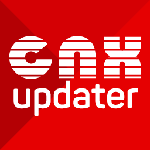

<h1 align="center">CNX Updater</h1>

Um homebrew de Nintendo Switch, baseado no homebrew [AIO-Switch-Updater](https://github.com/HamletDuFromage/aio-switch-updater/), para fazer o download e atualizar firmwares e o custom firmware [CNX](https://github.com/CostelaCNX/CNX-Updater/releases).

CNX Pack é um pacote all-in-one (tudo em um) de custom firmware que inclui o Atmosphère, sigpatches, hekate, nyx e vários outros homebrews.

Este homebrew suporta Atmosphère, ReiNX e SXOS, e funciona em consoles não corrigidos (`Erista`) and corrigidos (`V2/Mariko`).

## **[FAÇA O DOWNLOAD POR AQUI!](https://github.com/CostelaCNX/CNX-Updater/releases/latest) 

## Como instalar?
Baixe o arquivo `cnx-updater.zip` do link acima e o extraia na `raiz` do microSD.
No final você deve ter uma pasta `cnx-updater` dentro da pasta `/switch`.

## Onde achar o homebrew e como iniciá-lo?
Abra a lista de homebrews do seu desbloqueio (no `Atmosphère` é o botão do `Album`) e execute o homebrew `CNX Updater`.
Se você estiver com dúvidas de como usar o homebrew, aperte o botão `X` e uma janela de ajuda irá aparecer.

## Descrição das funções
### ⬦ Baixar Atmosphère
- Baixa o pacote (`CNX`).
  - Também é possível baixar pacote all-in-one (`GNX`) feito pelo Goma.
-  Após baixado, o programa irá instalar o pacote para você.

### ⬦ Baixar firmwares
- Baixa os arquivos do firmware para a pasta `/firmware` que, posteriormente, podem ser instalados usando o homebrew Daybreak.

### ⬦ Baixar traduções
- As traduções são feitas por membros da cena e tem a finalidade de distribuir acessibilidade linguística aos jogos.
- Algumas traduções precisam de passos específicos para que funcionem. Para maiores detalhes consulte os sites dos criadores das legendas:
  - https://www.jumpmanclubbrasil.com.br/
  - https://traducoespkg.tumblr.com/
  - https://nintendonxbr.blogspot.com/

### ⬦ Baixar modificações
- As modificações de jogos, também conhecidos por MODS, são feitas por membros da cena e tem a diversas finalidades. Vão desde melhorias gráficas até trapaças (cheats) ou trainers (uma espécie de trapaça adicionada quando o jogo não vem com trapaça "de fábrica".
- Algumas modificaçõs precisam de passos específicos para que funcionem. Para maiores detalhes pesquise online sobre tais modificações e procure se inteirar sobre a mesma.

### ⬦ Extras (na página `Ferramentas`)
- Editar as configurações da internet (DNS, endereço IP, MTU, etc). Adicione suas próprias configurações em `config/aio-switch-updater/internet.json`. Você vai achar um modelo desta configuração neste repositório.
- Abrir o navegador de internet do Switch (precisa abrir usando um jogo e pressionar R).
- Limpar os arquivos temporários baixados.
- Abrir a última mensagem do dia (MOTD) disponível no servidor.
- Consultar as alterações sofridas pelo homebrew (changelog).

## Disclaimer
O CostelaCNX não detém nenhum direito de cópia sobre nenhum arquivo baixado por este homebrew e todo o crédito pertence aos seus respectivos proprietários. Se o atual proprietário do arquivo baixado por este atualizador solicitar, removeremos imediatamente a habilidade de baixar qualquer arquivo problemático.

## Agradecimentos especiais
- [Coldmvm](https://github.com/coldmvm/) pelo brilhante homebew APG, no qual sem ele o CNX Pack não existiria.
- [HamletDuFromage](https://github.com/HamletDuFromage/) pelo brilhante homebew AIO-Switch-Updater.
- [natinusala](https://github.com/natinusala) pela biblioteca Borealis.
- [Team Neptune](https://github.com/Team-Neptune) pelo código RCM usado.
- [CostelaBR](https://github.com/CostelaCNX) pela sugestão da função de baixar traduções.

## 📝 Licença

O nome Nintendo Switch e logo são marcas registradas de [Nintendo](https://github.com/Nintendo). Este repositório não é afiliado a [Nintendo](https://github.com/Nintendo) ou nenhum dos seus parceiros.

The Nintendo Switch names and logos are a trademark of [Nintendo](https://github.com/Nintendo). This repository is in no way affiliated with [Nintendo](https://github.com/Nintendo) or any of its partners.
